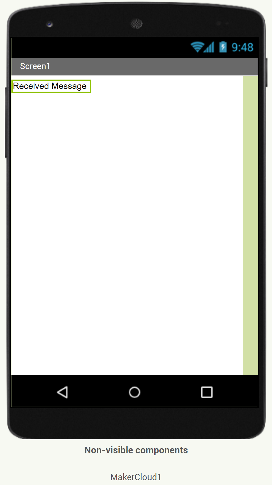
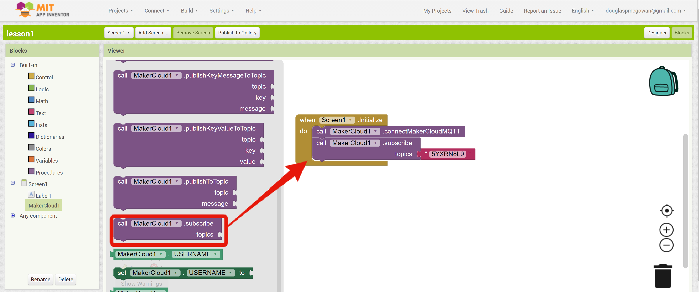
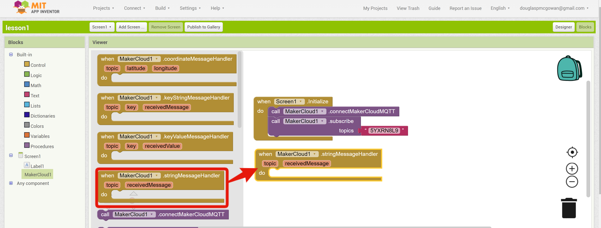

# Use App Inventor 2 to subscribe to topics
Before programming and subscribing to topics on Maker Cloud, users must first learn how to connect App Inventor 2 to Maker Cloud via MQTT. For instructions, refer to the following link:
[Using App Inventor 2 to connect to Maker Cloud](../../ch4_connect/ai2/connect_ai2.md)

[TOC]

## Subscription blocks
In Maker Cloud AI2 extension, there are different types of subscription blocks.

**Subscribing to a Topic**
{:width="40%"}
Subscribes to a topic after connecting to MakerCloud.
We recommend it in "When Screen is initialized" and after "Connect MakerCloudMQTT".

**When MakerCloud.stringMessageHandler**
{:width="50%"}
When a text message on the subscribed topic is received, this block will run

**When MakerCloud.keyStringMessageHandler**
{:width="55%"}
When a key text message is received, this block will run.

**When MakerCloud.keyValueMessageHandler**
{:width="55%"}
When a key-value pair message is received, this block will run
**當MakerCloud.coordinateMessageHandler**  
{:width="55%"}  
When a latitude and longitude message is received, this block will run

Use the subscription block that corresponds to the data type you want to receive.

## Subscribing and receiving text messages
#### Learning Focus:
- Learn how to receive text messages from subscribed topics through AI2

#### Goals:
- Subscribe to topics
- Receive MQTT text messages from Maker Cloud

{:width="90%"}

**Before programming on AI2, we need to be prepared on MakerCloud:**

1. Create a project
2. Create a topic

**Then you can program on AI2:**
1. Create a project
     
2. Add the Maker Cloud AI2 extension
   [MakerCloud AI2 extension](../../ch4_connect/ai2/extension/scale.MakerCloud.aix) (right click to save a new file)
     
3. Add a "MakerCloud" title and "Tags" to Screen1
   {:width="40%"}
     
4. In the component properties of MakerCloud, set the USERNAME to "maxwong"
   {:width="35%"}

**Designing the program**

1. Add the Connect Maker Cloud Block to the "When Screen1 is initialized"
     
2. Add a "subscribe to Maker Cloud" topic block, then copy and paste the name of the topic you want to subscribe to.
   {:width="70%"}
     
        

3. Add a "When MakerCloud.stringMessageHandler" building block
   
     
4. Set the text of label 1 to "receivedMessage" and place the block inside the "When MakerCloud.stringMessageHandler" block
   {:width="65%"}

When finished, return to the homepage of Internet of Things in your project.
Press the "Details" button in the topic to enter the topic homepage.
In the text input box of "Send Message to Subject", enter "hello" and click "Send".

The label on the App will show "hello".

**Note: If you subscribe to more than one topic, you should use logic blocks to check the topic after receiving the message and before displaying it**
{:width="70%"}

